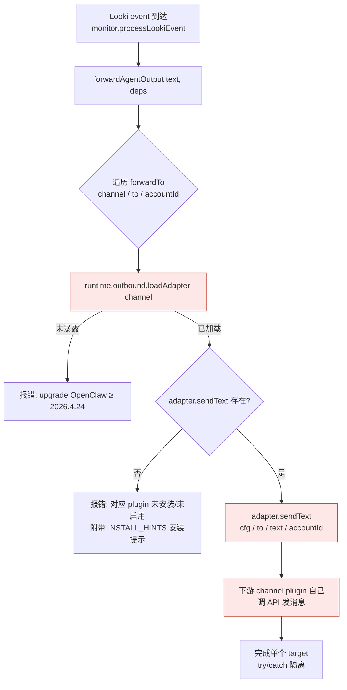
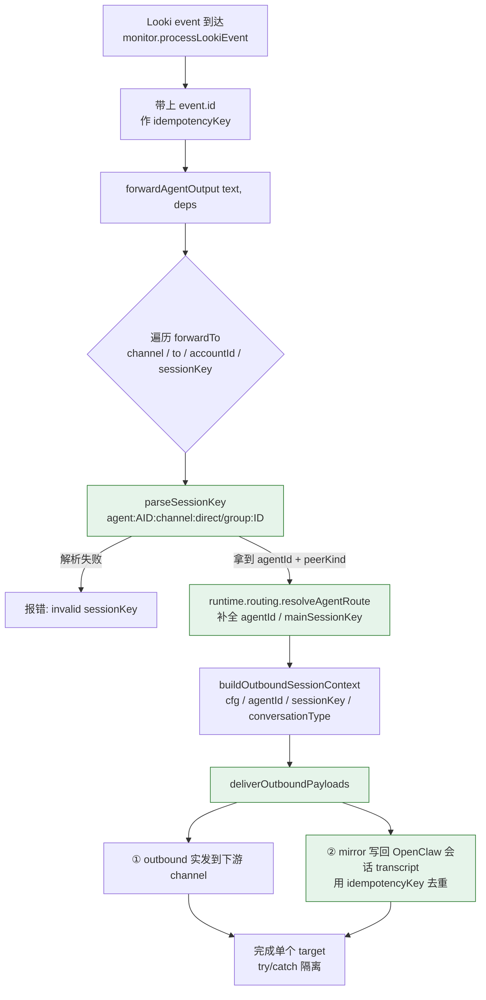

# 转发机制改造对比：`outbound.loadAdapter` → `deliverOutboundPayloads` + `sessionKey`

## 改造前：走 `outbound.loadAdapter`

关键点：

- 依赖每个 channel 插件暴露 `outbound.sendText` 适配器
- 只有"发出去"，**不会**写回 OpenClaw 会话 transcript
- 无幂等 key，同一 Looki 事件重投会产生重复消息
- `forwardTo` 仅 `{channel, accountId?, to}`，不知道要发到哪个 OpenClaw session

---

## 改造后：走 `deliverOutboundPayloads` + `sessionKey`

关键点：

- `sessionKey` 在 CLI wizard 阶段就从 OpenClaw 已存在的会话里选好（format: `agent:<agentId>:<channel>:<direct|group|channel>:<peerId>`），`direct/group` 路由完全从它推导
- 统一走 `openclaw/plugin-sdk/outbound-runtime`，不再关心各个 channel 插件自己暴露什么适配器
- 自带 **mirror**：转发内容也会出现在目标 session 的聊天历史里
- 用 `event.id` 构造 `idempotencyKey`，重投不会重复发

---

## 字段 / 调用对照

| 维度 | 改造前 | 改造后 |
|---|---|---|
| 入口 | `runtime.outbound.loadAdapter(channel)` | `deliverOutboundPayloads({...})` |
| 路由推导 | 无 | `parseSessionKey` + `routing.resolveAgentRoute` |
| `forwardTo` 字段 | `channel, to, accountId?` | `channel, to, accountId?, **sessionKey**` |
| direct vs group | 下游 adapter 自己判断 | 从 `sessionKey` 第 4 段推导 |
| 会话 transcript | 不写入 | `mirror` 同步写入目标 session |
| 幂等 | 无 | `openclaw-looki:forward:<channel>:<acct>:<to>:<event.id>` |
| 失败隔离 | `Promise.all` + try/catch | 保持不变 |
| CLI 交互 | 手填 `to` / `accountId` | 从已有 OpenClaw 会话里选 |
| 依赖版本约束 | OpenClaw ≥ 2026.4.24（暴露 loadAdapter） | 依赖新的 `outbound-runtime` 导出 |
